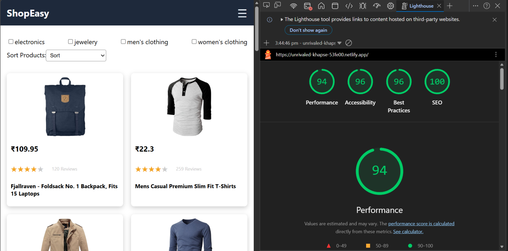

# 🛍️ ShopEasy – Scalable E-commerce Web Application

A production-ready, responsive e-commerce application built using **React + TypeScript**, designed with a focus on **performance, scalability, accessibility, and clean architecture**.

---

## 🚀 Live Overview

ShopEasy simulates a real-world e-commerce experience with product discovery, filtering, sorting, detailed views, and cart management — all optimized for performance and usability.

---

## ✨ Key Features

* 🏠 **Product Listing** with dynamic data fetching
* 🔍 **Multi-select Category Filtering** (URL-driven state)
* 📊 **Sorting** (Price & Rating)
* 📄 **Product Detail View**
* 🛒 **Cart Management** (Add, Remove, Quantity Control)
* 🔗 **URL State Sync** using query params
* ⚡ **Code Splitting & Lazy Loading** (React Suspense)
* 🧠 **Global State Management** via Context API
* 📱 **Responsive Design** (Mobile-first approach)
* 🧪 **End-to-End Testing** with Cypress
* 🚀 **Performance Optimized** (Lighthouse-driven improvements)

---

## 🛠️ Tech Stack

* **Frontend:** React (CRA) + TypeScript
* **Routing:** React Router
* **State Management:** Context API
* **Styling:** CSS (Responsive + Flex/Grid)
* **Testing:** Cypress (E2E)
* **Performance Tools:** Lighthouse, Chrome DevTools

---

## 📦 Getting Started

### 1. Clone the Repository

```bash
git clone https://github.com/Lokesh777/ecommerce-app.git
cd ecommerce-app
```

---

### 2. Install Dependencies

```bash
npm install
```

---

### 3. Run in Development

```bash
npm start
```

App will be available at:
👉 http://localhost:3000

---

### 4. Run Production Build (Recommended for Evaluation)

```bash
npm run build
npx serve -s build
```

---

## 🧪 Running Tests (Cypress)

### Open Cypress UI

```bash
npx cypress open
```

### Run in Headless Mode

```bash
npx cypress run
```

---

## ✅ Test Coverage

* Page navigation flows
* Product listing visibility
* Product detail rendering
* Cart operations (add/remove/update)
* UI interaction validation

---

## 🚀 Performance & Optimization

This project was iteratively optimized using **Lighthouse audits** and performance profiling.

### 📊 Achieved Scores (Production Build)

* ⚡ Performance: **90+**
* ♿ Accessibility: **95+**
* ✅ Best Practices: **95+**
* 🔍 SEO: **100**

---

### 🔧 Key Optimizations

* **Code Splitting:** `React.lazy` + `Suspense`
* **Image Optimization:** CDN-based transformation (Cloudinary fetch → WebP, compressed, resized)
* **Memoization:** Reduced unnecessary re-renders
* **Efficient Data Fetching:** Caching & conditional API calls
* **Lazy Loading:** Images & routes
* **Accessibility Fixes:** Proper labels, semantic structure, contrast improvements


---

## 🧠 Architecture Highlights

* Separation of concerns (`components`, `pages`, `services`, `context`)
* URL-driven state (filters & sorting persisted in query params)
* Reusable and composable components
* Clean TypeScript typing for scalability

---

## 📁 Project Structure

```
src/
 ├── components/     # Reusable UI components
 ├── pages/          # Route-level pages
 ├── context/        # Global state management
 ├── services/       # API abstraction layer
 ├── types/          # TypeScript interfaces
 ├── App.tsx
```

---

## 🧠 Assumptions

* API responses are consistent and reliable
* Product IDs are unique
* No authentication required for this scope
* Cart state is client-side only

---

## ⚠️ Limitations

* No backend (uses public API)
* No persistent storage (cart resets on refresh)
* No authentication/authorization
* No pagination or infinite scrolling

---

## ✨ Additional Enhancements

* 🔄 API response caching to reduce redundant calls
* 📌 Sticky filter bar for improved UX
* 📱 Mobile-friendly horizontal filters
* 🚫 Disabled duplicate cart additions
* ♿ Improved accessibility (labels, semantic tags)
* 🎯 Clean and minimal UI for better usability

---

## 📌 Accessibility

* Semantic HTML (`section`, `article`, `header`)
* Proper form labeling (`label + htmlFor`)
* Keyboard-friendly interactions
* Improved color contrast for readability


## 📬 Contact

**Lokesh Kumar**
Frontend Developer
📧 [lokeshdevgan777@gmail.com](mailto:lokeshdevgan777@gmail.com)

---
